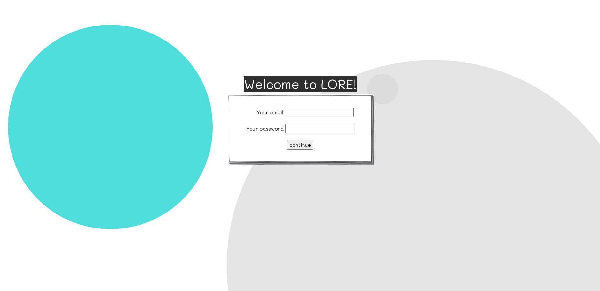
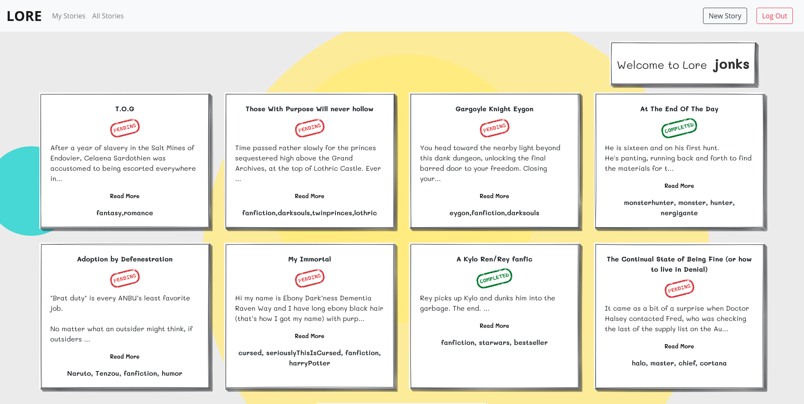
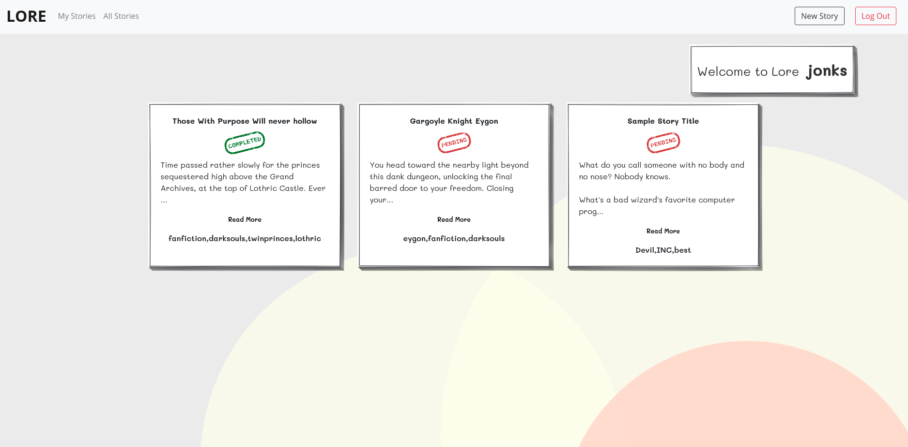
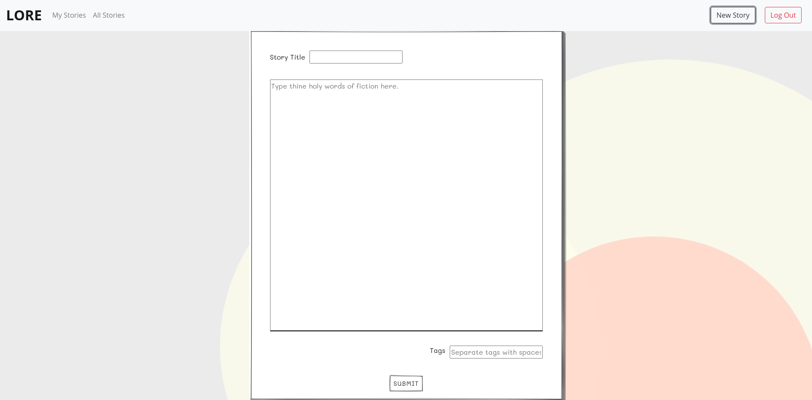
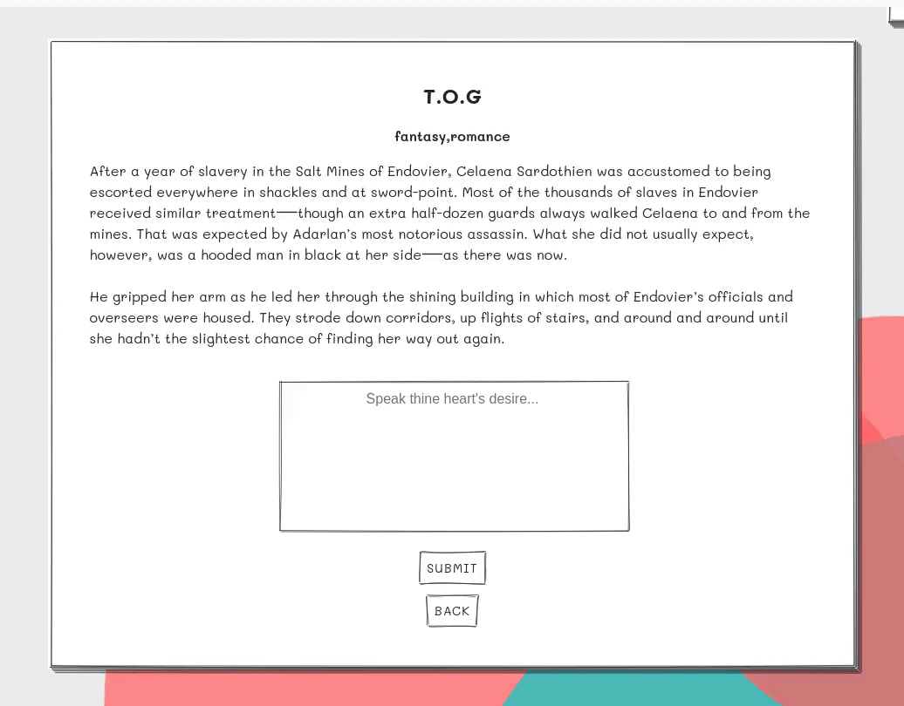
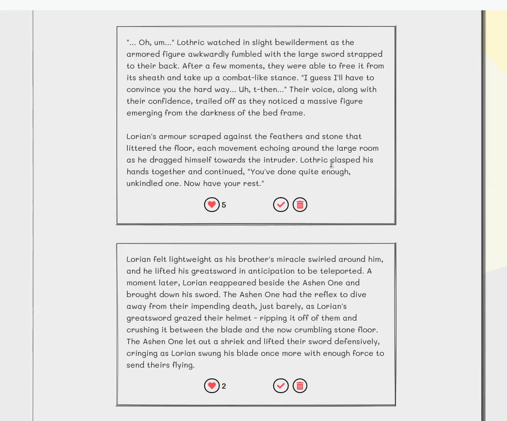
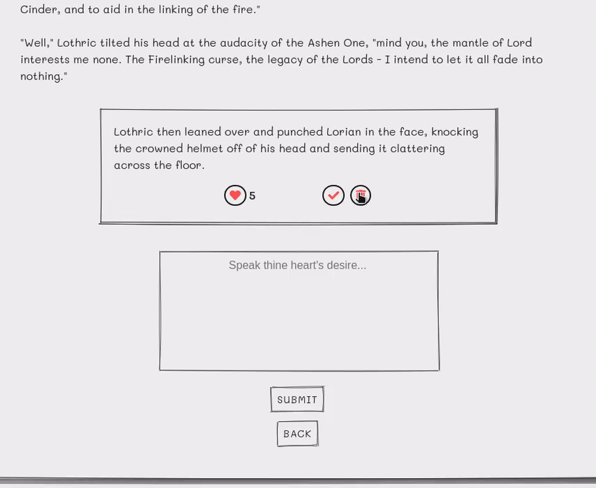
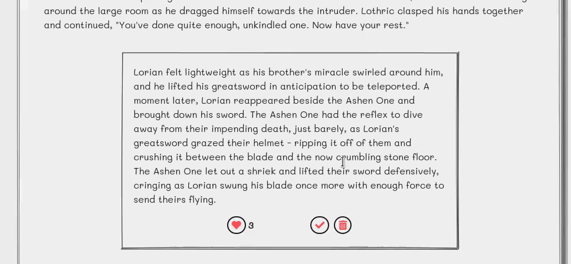

# WELCOME TO L O R E ~

# DEMO

## About This Project

LORE is a collaborative story-creator webapp, which lets users post the start of a story, and have other users submit contributions (known as pieces). If the owner of the story deems the contribution worthy, they may merge it to the original story.

Features include:

1. Users can start a story with a specified title, as well as tags.
2. Users can add contributions to existing stories.
3. Users can see and upvote the contributions that they like.
4. The creator of the story can approve a contribution and have it merge seamlessly to the rest of the story.
5. Users can view all of the stories, whether pending or completed, on the main page, as well as view their own stories under the "My Stories" tab.
6. The creator of the story can mark theirs as "completed", stopping further contributions from being added, and removing any pending ones.

## Getting Started

1. Create the `.env` by using `.env.example` as a reference: `cp .env.example .env`
2. Update the .env file with your correct local information

- username: `labber`
- password: `labber`
- database: `midterm`

3. Install dependencies: `npm i`
4. Fix to binaries for sass: `npm rebuild node-sass`
5. Reset database: `npm run db:reset`

- Check the db folder to see what gets created and seeded in the SDB

7. Run the server: `npm run local`

- Note: nodemon is used, so you should not have to restart your server

8. Visit `http://localhost:8080/`

## Warnings & Tips

- Do not edit the `layout.css` file directly, it is auto-generated by `layout.scss`
- Split routes into their own resource-based file names, as demonstrated with `users.js` and `widgets.js`
- Split database schema (table definitions) and seeds (inserts) into separate files, one per table. See `db` folder for pre-populated examples.
- Use the `npm run db:reset` command each time there is a change to the database schema or seeds.
  - It runs through each of the files, in order, and executes them against the database.
  - Note: you will lose all newly created (test) data each time this is run, since the schema files will tend to `DROP` the tables and recreate them.

## Dependencies

- Node 10.x or above
- NPM 5.x or above
- PG 6.x
